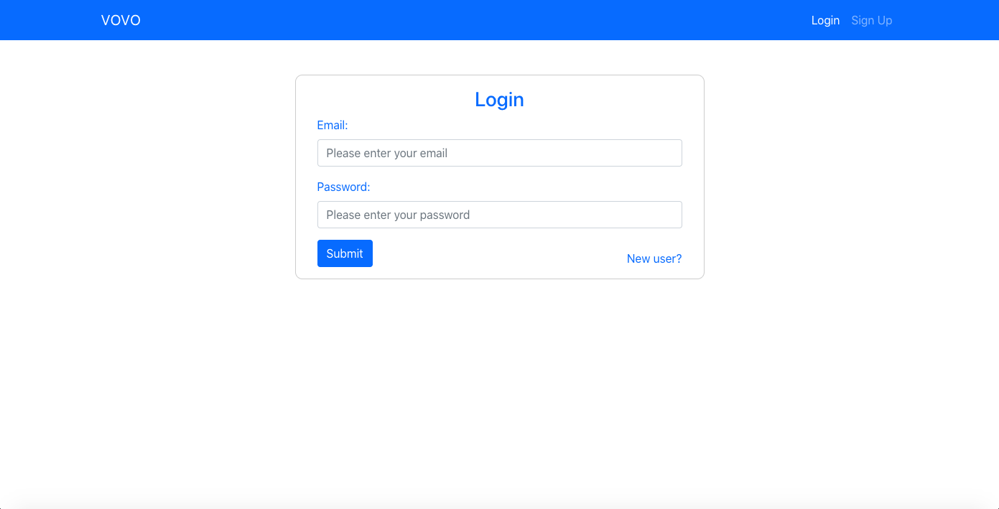
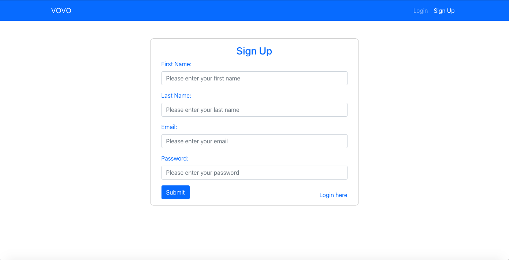
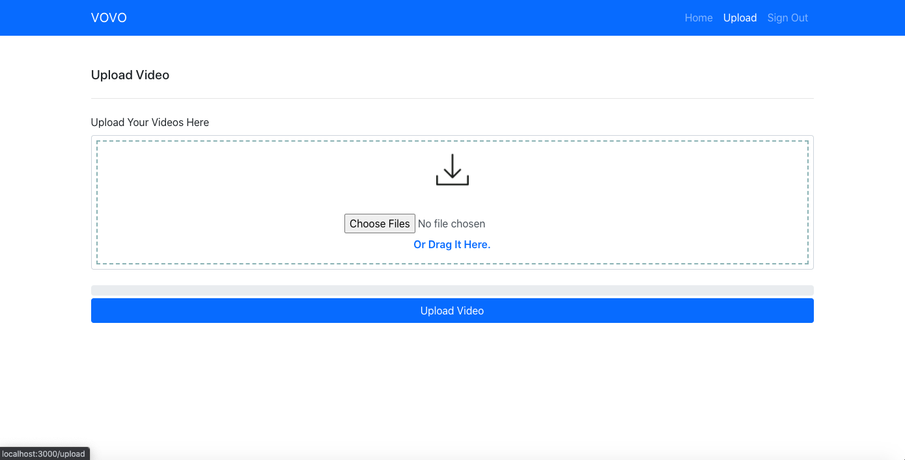
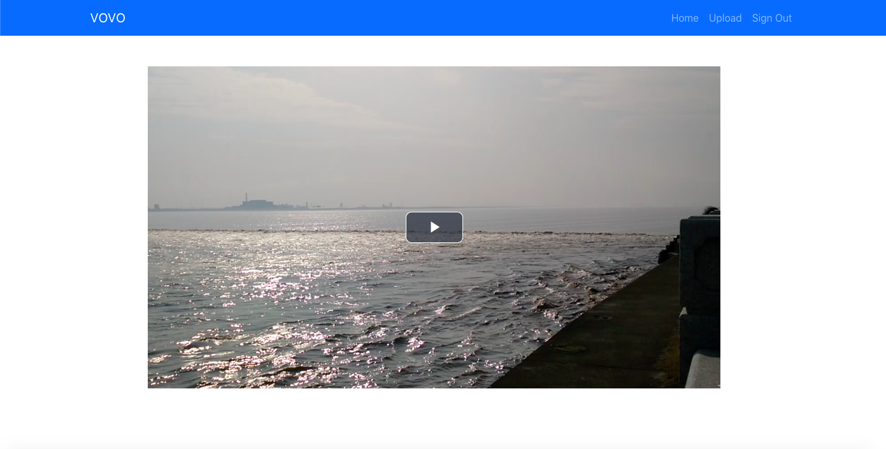

# "Vovo" Video Server
Vovo is a full-stack web application built with React, Node.js and Express for video sharing that supports user login/signup with JWT Authentication, video upload, thumbnail generation and video streaming

## Screenshots
Login Page

Signup Page

Browse Page

Upload Page

Streaming Page

